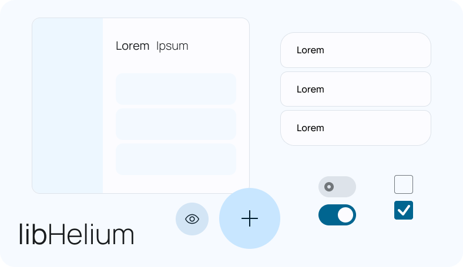

# libhelium

The elegant framework for building beautiful and useful apps. Built on GTK, libhelium is suited for building amazing native applications, regardless of design background or skill level.

###

[](http://www.gnu.org/licenses/gpl-3.0)



<!-- TODO(lleyton): Installation -->

## 🚀 Getting Started

Welcome! Please see the various resources below. If you have any questions, our [Discord](https://discord.gg/BHNfGewTXX) is always open :)

<!-- TODO: Proper getting started tutorial, and much much more docs -->

- [The tauOS HIG](https://developers.tauos.co/docs/hig)
- [libhelium's Valadoc](https://docs.developers.tauos.co/libhelium/libhelium/index.htm)
- [libhelium's Rustdoc](https://docs.developers.tauos.co/rust/libhelium/index.html)

> **Note**
> libhelium's documentation is a bit sparse right now, if you'd like to help us, please see [#23](https://github.com/tau-OS/libhelium/issues/23).

## 🖼️ Showcase

<!-- List of apps using libhelium in the wild -->

Made an application in libhelium? Make a pull request and add it to our showcase!

## 🛠️ Dependencies

Please make sure you have these dependencies first before building.

```bash
gtk4
libgee-0.8
meson
vala
```

Please note that the demo also requires the following dependencies.

```bash
libbismuth-1.0
blueprint-compiler
```

Generating documentation requires the following.

```bash
valadoc
gi-docgen
```

## 🏗️ Building

Simply clone this repo, then:

```bash
meson _build --prefix=/usr && cd _build
sudo ninja install
```
